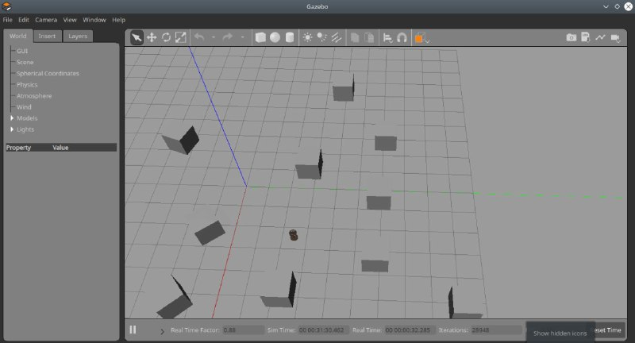
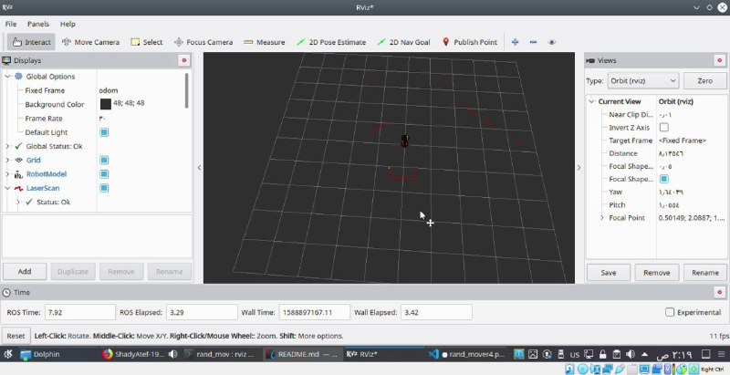
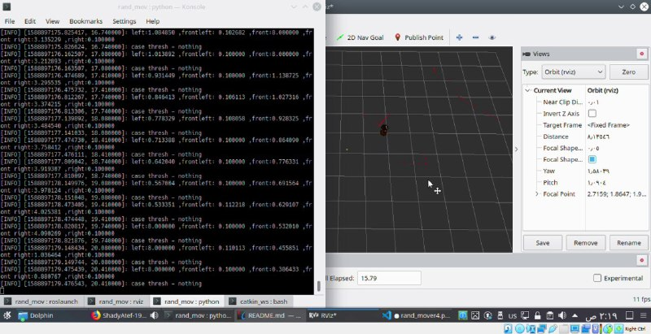
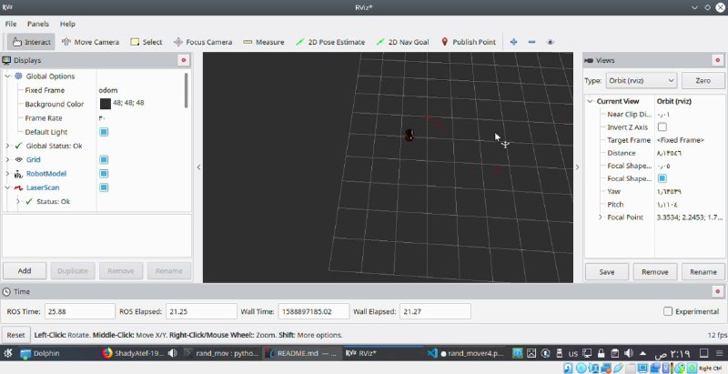

# Betabot Obstacle avoider

- [Betabot Obstacle avoider](#betabot-obstacle-avoider)
  - [Project Description](#project-description)
  - [After you implement the pkg state your reflection below](#after-you-implement-the-pkg-state-your-reflection-below)
    - [How did you plan the task?](#how-did-you-plan-the-task)
    - [what is your logic?](#what-is-your-logic)
    - [What ROS REPs did you used?](#what-ros-reps-did-you-used)
    - [How we could increase the overall performance?](#how-we-could-increase-the-overall-performance)
    - [List the most time consuming problems you faced](#list-the-most-time-consuming-problems-you-faced)
    - [Demo](#demo)
    - [Screenshot](#screenshot)
      - [NAME:](#name)
      - [ID:](#id)

## Project Description 

Create a ROS package with custom nodes c++/python to move the
betabot randomly in gazebo, the movement should be triggered then the robot
moves randomly while avoid objects based on laser scans reading based on the laser
scans.

>NOTE: DON'T process one ray of the laser scans array or it will be considered ultrasonic/IR sensor.try to come up with approach thats use the laser full potential. 

>To make you project standout try not to visit any place twice.

---

## After you implement the pkg state your reflection below
This project gives the ability to understand laserscan and how to work with it ROS Gazebo.
### How did you plan the task?
- Searching for Lasercan and topics it uses.
- Mapping Laserscan data (ray directions) to our betabot model.
- Implementing the first version of the code used the information gained form the above steps.
- After the first implementation, problems occured, so I tried to do some debugging and created other 3 versions of the code trying to get it working.
### what is your logic?
- First, I try to move the robot with Twist commands.
- While the robot is moving, it is alwyas checking all the near field (from all directions) for obstacles.
- If the robot is approaching an obstacle with a specified distance (Threshold), it rotates trying to find a free space and do the cheking again, so on.
- Some randomness is applied to the robot movement to avoid stucking cases.
### What ROS REPs did you used?
- LaserScan
- Twist
- ROSpy
- ROS nodes
### How we could increase the overall performance?
We may add other sensors along with the laserscan so that the robot gets more accurate data about obstacles and can avoid them better (for example, if there are too many obstacles with small distances in between).
### List the most time consuming problems you faced
 The Problem that takes most of the time is trying to get the range data of LaserScan for the betabot robot. The axes for robot were swapped and it takes effort to get the correct range values for all directions and mapping those indices to the laserScan data.
---

### Demo

[Demo](https://drive.google.com/open?id=1k2e3fr6Ap6OM1N0AaX2DlZd-C2nKgjNu)

### Screenshot

[image]

   

   

   

   

---

#### NAME: Shady Atef Mohamed
#### ID: 201500841

---
