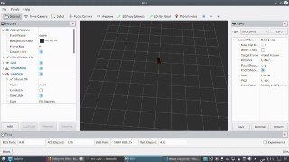
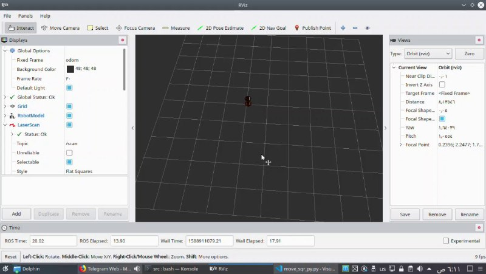
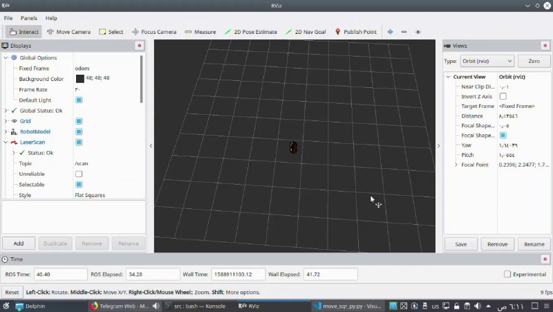
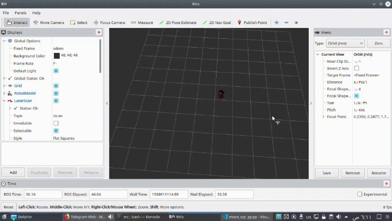

# Betabot Moving in Square

- [Betabot Moving in Square](#betabot-moving-in-square)
  - [Project Description](#project-description)
  - [GUIDE](#guide)
  - [After you implement the pkg state your reflection below](#after-you-implement-the-pkg-state-your-reflection-below)
    - [How did you plan the task?](#how-did-you-plan-the-task)
    - [What ROS REPs did you used?](#what-ros-reps-did-you-used)
    - [How we could increase the overall performance?](#how-we-could-increase-the-overall-performance)
    - [List the most time consuming problems you faced](#list-the-most-time-consuming-problems-you-faced)
  - [Demo](#demo)
  - [Screenshot](#screenshot)
      - [NAME:](#name)
      - [ID:](#id)

## Project Description 

Create a ROS package with custom service/action c++/python to move the betabot in gazebo, the movement
triggered will have to be a square, like in the image below:
Betabot movement Use the data passed to this topic /move_betabot_in_square_custom to change the way
betabot moves. Depending on the side value, the service must move the robot in a square
movement based on the side given. Also, the robot must repeat the shape as many times as
indicated in the repetitions variable of the message. Finally, it must return True if everything
went OK in the success variable.


## GUIDE

1. Create a new launch file, called start_betabot_move_custom_service_server.launch,
that launches the new betabot_move_custom_service_server.py file.
2. Test that when calling this new /move_betabot_in_square_custom service, betabot
moves accordingly. This means, the square is performed taking into account the side
and repetitions variables.
3. Create a new service client that calls the service /move_betabot_in_square_custom,
and makes betabot moves in a small square twice and in a bigger square once.
It will be called betabot_move_custom_service_client.py. The launch that starts it will
be called call_betabot_move_in_square_custom_service_server.launch.
4. Refer to this tutorial for more help.
The BetabotCustomServiceMessage.srv will be something like this:

```sh
float64 side # The distance of each side of the square
int32 repetitions # The number of times the betabot robot has to execute the square
movement when the service is called
---
bool success # Did it achieve it?
```

>NOTE: The side variable doesn’t represent the real distance along each size of the square.It’s just a variable that will be used to change the size of the square. The bigger the size variable is, the bigger the square performed by the robot will be. You can use any robot pkg.

>To make you project standout try another shape and to use filtered `odemtry` data.

---

## After you implement the pkg state your reflection below
This lab gives the knowledge about twist messages and how to use them to move robots.
### How did you plan the task?
- Searching for topics that used for moving robots in ROS.
- Choose Twist for moving and search how to use it.
- Implement the code using twist message.
- Debugging and slovig errors.

### What ROS REPs did you used?

- Twist Messages.
- ROSpy

### How we could increase the overall performance?
We could use odom topic to give feedbback to the robot and produce better results.

### List the most time consuming problems you faced

- Problems with C++ ,its libraries and integration with ROS had a big deal. Header files (.h) for ros packages causes conflicts and is not easy to manipulate, so finally I used rospy with python instead of roscpp.
---h

## Demo

[Demo](https://drive.google.com/file/d/1adlwyhVpbfu7Y4FwG3nQ50r1LEobmpP-/view?usp=sharing)

## Screenshot

[image]

 
</p>

 
</p>

 
</p>

 
</p>

 
</p>
---

#### NAME: Shady Atef Mohamed
#### ID: 201500841

---
